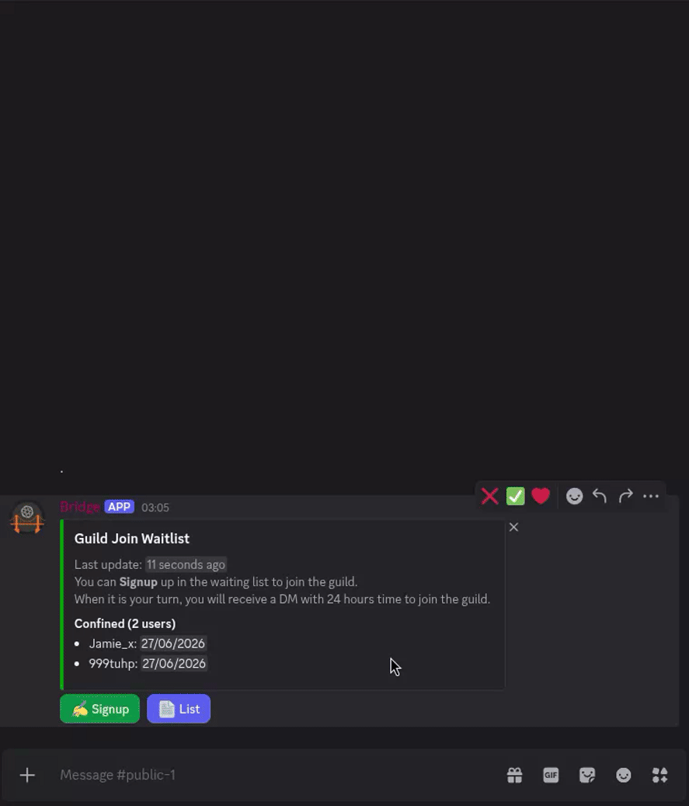
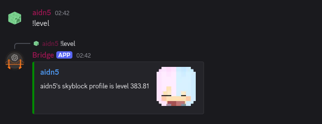
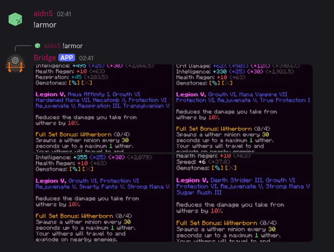
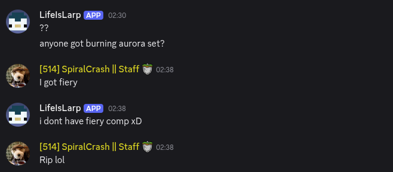
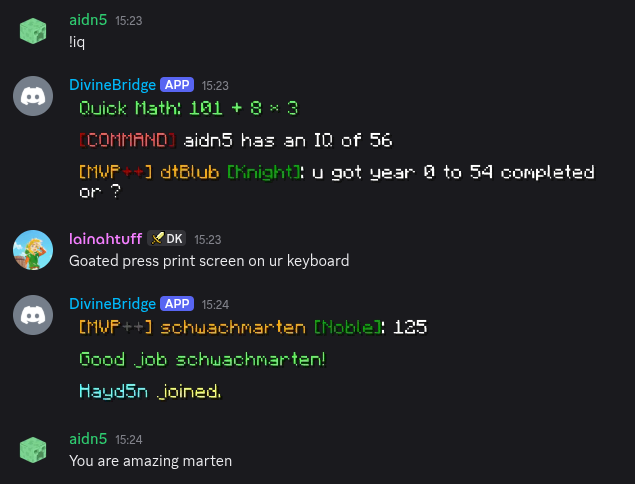
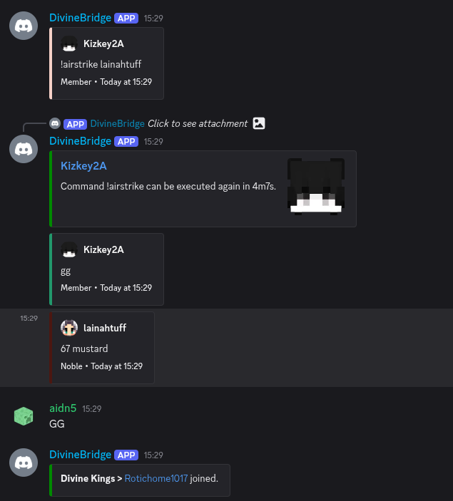
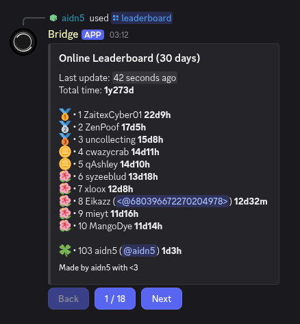
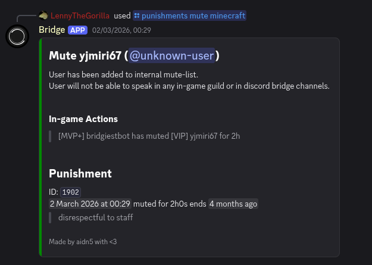
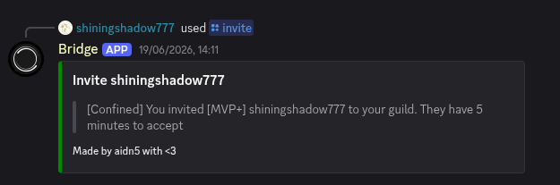

# hypixel-guild-discord-bridge

  
  
  
  

  
## Introduction

A two-way chat bridge between Hypixel guilds and Discord channels.  
This project is made with the philosophy to be fully user-oriented giving users full control with a simple yet an eye-candy UI.

> **_DISCLAIMER_: This project interacts with Hypixel in an unintended way by simulating a minecraft client and by processing
> packets which might get you banned if over-abused.  
> Just like any other modification and service that interacts with Hypixel servers, this goes without saying: "Use at
> your own risk"**

## Documentation And Tutorials

- [How to install and run](docs/INSTALL.md)
- [Frequently asked questions](docs/FAQ.md)
- [Permissions required to function](./docs/PERMISSIONS.md)
- [All Commands And Interactions](docs/COMMANDS.md)
- [Compatibility and future support](docs/COMPATIBILITY.md)
- [Migrating to newer version](docs/MIGRATION.md)
- [Tracking metrics via Prometheus](docs/PROMETHEUS.md)
- [Security Policy](SECURITY.md)
- [Privacy Notice](docs/PRIVACY.md)
- [How to create plugins](docs/PLUGIN-TUTORIAL.md)
- [Contribute](CONTRIBUTING.md)
- [Development Documentation](./docs/DEVELOPMENT.md)

## Features

- Bridge multiple guilds chats and Discord channels
- Supports public, officer and private chat in-game
- Supports in-game moderation commands from Discord
- Fully synchronize in-game chat and interactions with Discord including guild events such as
  online/offline/join/leave/mute notification/etc
- Support many commands from fun ones to management ones
- Logs all chats/events/etc as records for staff to view
- Provides detailed metrics per user and per guild (by Prometheus or by leaderboard)
- Supports custom plugins with fully fleshed out public API
- Supports proxies for Minecraft instances
- Auto guild ranks and Discord roles sync with custom conditions
- Automated management and moderation tools such as punishments, join waitlist

## Showcase

**Control all the settings from fancy yet simple interface.**  
**No more editing complicated configuration files or waiting for the hosting provider to do it for you.**  

**Automate your guild's management, from waitlist to automated in-game rank syncing**  

**Over 100+ quality-of-life chat commands spanning from stats commands to fun and games ones:**  

**Feel at home with the support of all popular chat types (webhook, embed, minecraft render style)**  

**Keep track of your guild via metrics and leaderboards**  

**Manage the guild from anywhere and keep track of everything like never before**  

## Install and run

[Read and follow this guide](docs/INSTALL.md) to start.

## Privacy Notice

Aggregated anonymous data are collected to be displayed here on the main page,
such as how many total instances of this project is being hosted by everyone.

For further information, check [Privacy Notice](docs/PRIVACY.md).

## Credits

- The Project is inspired by [hypixel-discord-chat-bridge by Senither](https://github.com/Senither/hypixel-discord-chat-bridge).
- [Soopyboo32](https://github.com/Soopyboo32) for providing [an awesome command API](https://soopy.dev/commands)
- Aura#5051 for in-game commands: Calculate, 8ball, IQ, Networth, Weight, Bitches
- [WildWolfsblut](https://github.com/WildWolfsblut) for helping with various designs and structures
- [SkyCryptWebsite](https://github.com/SkyCryptWebsite) for providing [Senither weight](https://github.com/SkyCryptWebsite/SkyCrypt/blob/e2f421dec3a8afdd4830a26d206ec439e933266f/src/constants/weight/senither-weight.js)
- [Elite Skyblock](https://api.eliteskyblock.com) for providing the farming weight API
- [SHM](https://github.com/kOlapsis/shm) for providing a selfhost-able metrics server
- All contributors whether by code, ideas/suggestions or testing
